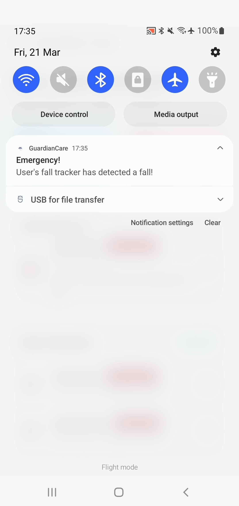

# GuardianCare - AI-Powered Elderly Management System

GuardianCare is a comprehensive elderly care management system designed to **enhance elderly safety and well-being** through an integrated approach combining mobile applications, backend services, and IoT devices. The system leverages **fall detection, AI-powered voice check-ins, and elderly management** capabilities to provide a complete solution for **caretakers, family members, and healthcare providers**.

## System Architecture

The GuardianCare system consists of three main components:

1. **GuardianCare_BackEnd**: A microservices-based backend system that handles authentication, elderly management, check-ins, notifications, and AI processing.
2. **GuardianCare_FrontEnd**: An Android mobile application built with Kotlin and Jetpack Compose for both elderly users and caretakers.
3. **GuardianCare_IoT**: IoT components including M5StickC Plus devices for fall detection and voice recording, along with gateway devices.

<div align="center">
  
</div>

## Key Features

- **AI-Powered Voice Check-In** - Elderly individuals can speak into the M5StickC Plus device, which records and sends their voice data to an LLM for processing. The AI summarizes their speech to understand how they feel and assigns a priority score based on urgency.
- **Fall Detection** - Uses M5StickC Plus smartwatch to detect falls and notify caretakers immediately.
- **Elderly Management** - Allows caregivers to manage, monitor, and assist elderly individuals through a comprehensive dashboard.
- **Light/Dark Mode** - Customizable UI themes for user comfort.
- **Multi-language Support** - Supports multiple languages for inclusivity.

## Screenshots

<div align="center">
  <br/>
  <em>Caretaker Dashboard</em>
</div>

<div align="center">
  <br/>
  <em>Elderly Dashboard</em>
</div>

<div align="center">
  <br/>
  <em>Check-In Interface</em>
</div>

<div align="center">
  <br/>
  <em>Alert Notification</em>
</div>

<div align="center">
  <br/>
  <em>M5Stick UI</em>
</div>

<div align="center">
  <br/>
  <em>Fall Detection on M5Stick</em>
</div>

## Prerequisites

- Docker and Docker Compose
- Android Studio
- Node.js
- M5StickC Plus
- Arduino IDE or PlatformIO

## Quick Start

### 1. Clone the Repository

```bash
git clone https://github.com/hakambing/GuardianCare.git
cd GuardianCare
```

### 2. Backend Setup

```bash
cd GuardianCare_BackEnd/services/k8s
# Copy the example environment file and configure your settings
cp .env.example .env
# Edit the .env file with your credentials
# Start the services
docker-compose up --build
```

### 3. Frontend Setup

```bash
# Open the GuardianCare_FrontEnd folder in Android Studio
# Run the app on an emulator or physical device with min SDK 24
```

### 4. IoT Device Setup

```bash
cd GuardianCare_IoT/fall_tracker
# Open the project in PlatformIO or Arduino IDE
# Upload the firmware to your M5StickC Plus device
```

## Environment Variables

To run this project, you will need to add the following environment variables to your .env file. Please contact the project owner for the actual values.

- `MONGODB_URI` - MongoDB connection string
- `JWT_SECRET` - Secret key for JWT token generation
- `FIREBASE_PROJECT_ID` - Firebase project ID
- `FIREBASE_CLIENT_EMAIL` - Firebase service account email
- `FIREBASE_PRIVATE_KEY` - Firebase service account private key

## Testing Accounts

Elderly Account:
- Email: elderly@example.com
- Password: password123

Caretaker Account:
- Email: caretaker@example.com
- Password: password123

## Component Documentation

For detailed documentation on each component, please refer to the README files in the respective directories:

- [Backend Documentation](GuardianCare_BackEnd/README.md)
- [Frontend Documentation](GuardianCare_FrontEnd/README.md)
- [IoT Documentation](GuardianCare_IoT/README.md)

## Demo

Watch a demo here: [GuardianCare Demo](https://youtu.be/ZJ6RMjp1TDg)

## Tech Stack

**Client:** Kotlin, Android Studio, Jetpack Compose

**Server:** Node.js, Express, MongoDB, Python, C++

**IoT Integration:** M5StickC Plus (ESP32), BLE Communication

**Cloud Services:** Firebase, Docker, Kubernetes

## Authors

- [Fawaz](https://github.com/FawazSIT)
- [Hakam](https://www.github.com/hakambing)
- [Hilman](https://github.com/apollo1e)
- [Syahmi](https://github.com/Voidstorm012)
- [Vignesh](https://github.com/SomeRandomGuyOnTheInternet)
- [Christian](https://github.com/candelabyte)
- [Nelson](https://github.com/Realez77)
- [Danish](https://github.com/Testwiwi)
